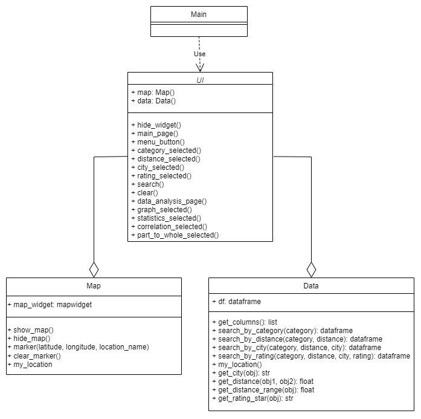
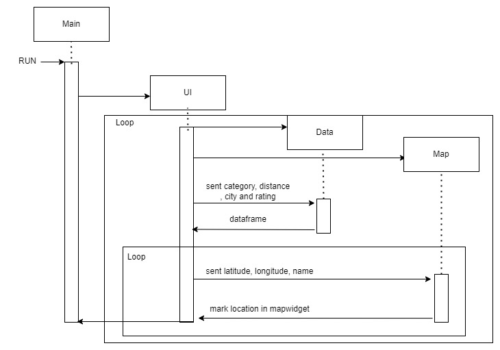

# Restaurants Near Me
## Description
Restaurant Near Me project is the application which users can search restaurant by category of restaurant, distance from user's location, city of restaurant and rating of restaurant in the main page. After user select data in combobox, The application will show location of each restaurant in the map. Users can also select Data Analysis menu in the menu button then the application will show descriptive statistics, distribution graph, Correlation and Part-to-whole graph which are analysis by restaurant data in Thailand.

## Data Sources
List the data sources used by the application, along with their descriptions
and links.
Getting the user's ip address to find user's location and mark in the mapwidget
https://www.freecodecamp.org/news/how-to-get-location-information-of-ip-address-using-python/
Using TkinterMapView to mark restaurant's location and show map in the window
https://github.com/TomSchimansky/TkinterMapView
 
## Running the Application
tkintermapview,
requests,
tkinter,
matplotlib.pyplot,
matplotlib.figure,
matplotlib.backends.backend_tkagg
 
## Design
UML Class Diagram

Sequence Diagram

 
## Design Patterns Used
Using Facade Design Pattern in UI class for using data, map class (logic layer)
 
## Graph Algorithm Used
I have use shortest path to find the nearest restaurant from user's location by using minimum of distance from user's location then the user can see the restaurant that is nearest from user's location
 
## Other Information
My interesting packages in my application are request and tkinter mapview. I use request for finding user's location the request command will response the user's ip address and user's location: latitude, longitude. I use the latitude and longitude to mark user's location and also compute the distance from user's location and restaurant location so the user can see restaurant near the user's location
